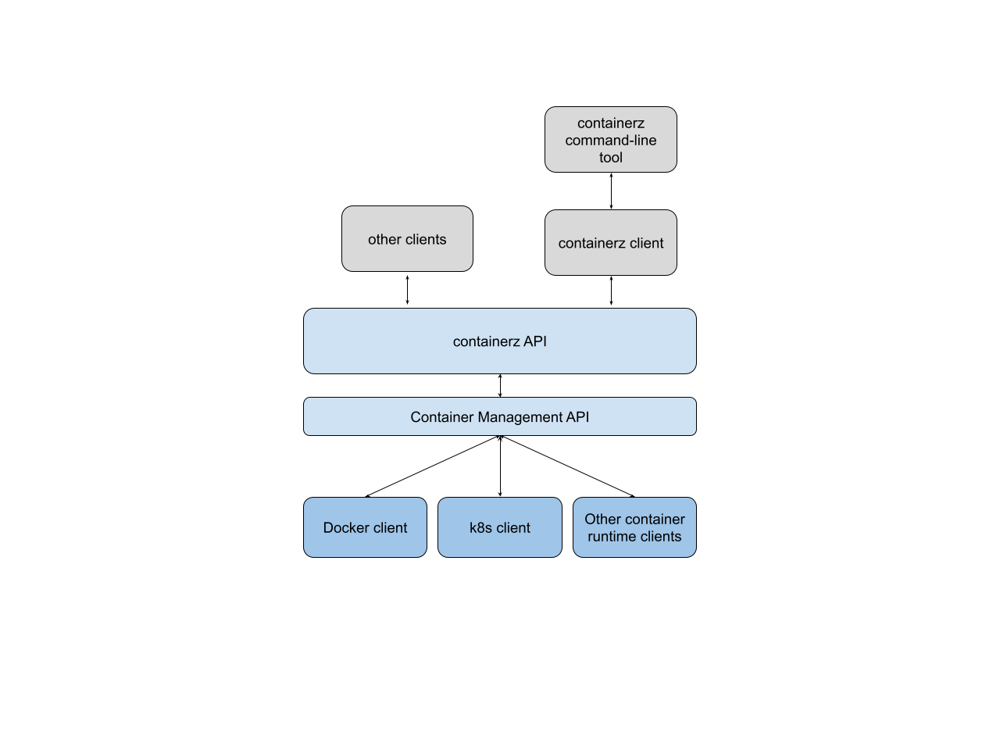
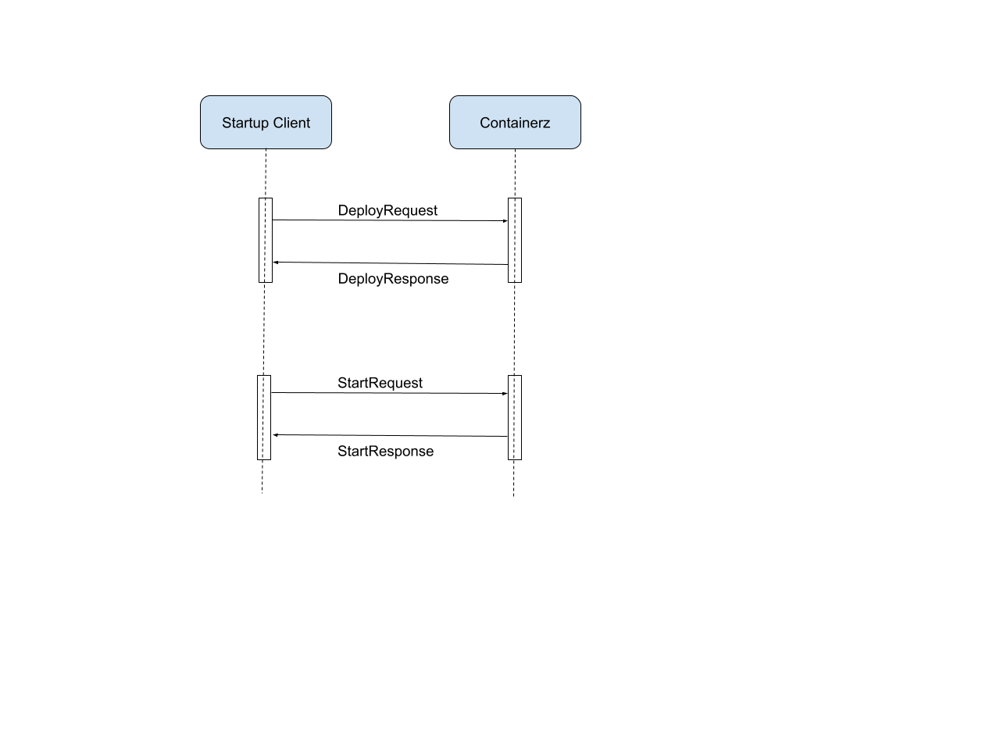
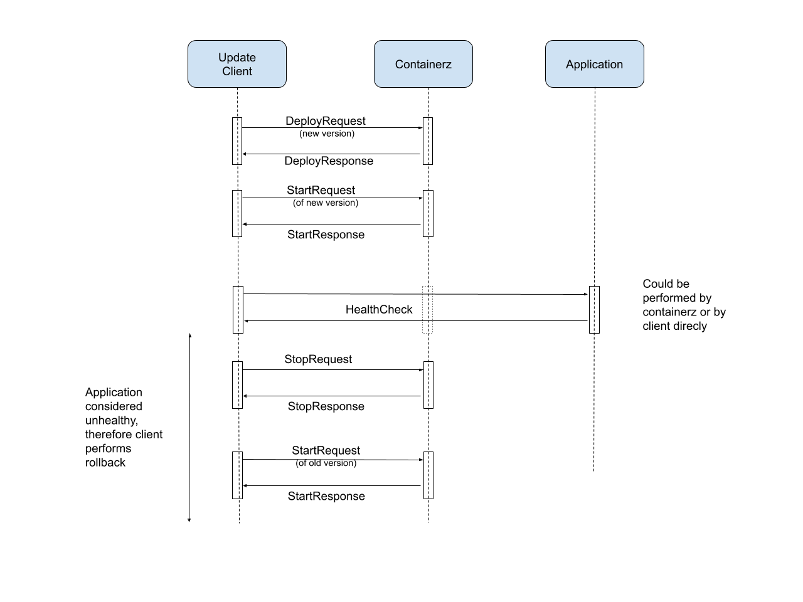

## containerz: Lifecycle management for containers on network devices

Contributors: {alshabib, robjs, morrowc}@google.com March 2024

## Problem Statement

Recent advances (including the availability of g* APIs) in vendor network
operating systems enable custom code to be executed on network devices as docker
containers.  Running software as containers on network devices requires new
infrastructure to manage the container’s lifecycle. While this infrastructure
largely exists in the compute world, it is currently not available for network
devices. Furthermore, it is not immediately evident that the same approach as
the compute world for managing containers is desirable given this new context
where we do not want to enable arbitrary code execution but rather only
sanctioned applications.

Currently, the common approach for transferring a container to a device is via
proprietary or CLI methods. This process is not appropriate for
production since under no circumstances should an operator log into a device to
make changes, it is also inconvenient when testing in the lab as the entire
manual process is complex and error prone.

## Requirements for Lifecycle Management

### Objective

The objective of a container lifecycle management system running on network
devices is to provide basic functionality that allows deploying containers. We
do not want to replicate the container runtime API but rather provide an
abstraction layer that safely deploys containers.

It is beyond the scope of this solution to provide application state management
for running containers, this is either the responsibility of the container
 runtime (for container specific state) or the container itself (for application
 state).
It is also beyond scope for this solution to determine the correct functioning
of a container other than optionally querying an API endpoint indicating that
the container is operating correctly.

The list below defines the minimum requirements for a container
lifecycle management system.

##### R-AUTH

The proposed solution should only provide access to authenticated users; 
otherwise, it should refuse access.

##### R-SCOPE

Users should only get access to scoped container operations. This is important
to limit access in production versus provisioning time. For example, an
authenticated user may be able to access logs but they should be unable to stop
a container. The set of scopes that must be supported is:

* **WRITE**: Ability to copy a container to the target as well as start, stop,
  configure or upgrade it.
* **READ**: Ability to fetch logs, introspect, and list existing containers.

##### R-GENERIC

The solution should not be tied to a specific container runtime but rather
expose the same API and adapt calls to the specific runtime.

##### R-PUSH

The solution should be able to push a container image to a target and optionally
tag the image to a specific name.

##### R-PULL (optional)

The solution should be able to pull an image from a specified registry and
optionally tag the pulled image.

##### R-START

The solution should be able to start a container. It should be able to provide
parameters when starting a container. The set of features that should be
supported are:

* _Ports_: mapping an internal container port to an arbitrary external port.
* _Environment Variables_: Setting environment variables in the container.

##### R-STOP

The solution should be able to stop a container and optionally remove the
container after stopping it.

##### R-UPGRADE

The solution should provide a means for upgrading itself as well as existing
containers.

##### R-LOGS

The solution should provide a means to obtain the logs from a running container.
Optionally, it can follow the logs such that they are streamed back to the
client until the client cancels the request.

##### R-CLEAN

The solution should clean up any dangling containers (e.g., containers that have
been stopped but not removed) and remove any unused container images. The cleanup
process should occur periodically.

##### R-VOLUME

The solution should support creating data volumes on the target system and
attaching the created volumes to containers such that configuration and other
data can be passed to containerized applications.

## Potential Solutions

### Bootstrap Container

Routers could be loaded with a modified router image. The image would include a
bootstrap container which would pull the latest image from a known
location. (i.e. a registry or other artifactory).

**Advantages:**

* This solution does not require a change in the router deployment workflow
  other than building a derived image.
* The bootstrap container can implement *R-CLEAN*.

**Disadvantages:**

* Does not implement most of the requirements explained above. For example, this
  solution does not provide a means to upgrade (*R-UPGRADE*) an existing
  container or the ability to obtain logs (*R-LOGS*).
* This solution would require that every new container release is aligned with a
  router software upgrade or that a new spin of a router software load be built
  to support upgrades. This seems like an onerous solution.
* This solution would require different versions to be able to support multiple
  container runtimes (*R-GENERIC*).
* This solution would tie container rollouts to potentially slow rollout
  procedures given the validation a router software load goes through.
* Finally, this model lacks a security model since once a software load is
  deployed it is not externally reachable.

### Native Docker API

This solution would require to secure and expose the docker API as well as run a
docker registry. An external application could orchestrate the
deployment of new containers.

**Advantages:**

* This solution would provide the ability to pull (*R-PULL*), push (*R-PUSH),
  upgrade (*R-UPGRADE*) and obtain logs (*R-LOGS*) from the target system.

**Disadvantages:**

* The security model is tied to the security model provided by Docker.
* Scaling issue -  This solution would need several registries since it would
  not be feasible to pull container images to every router in the network from a
  central image registry which would require a significant infrastructure
  deployment such as certificate and credential distribution.

### New gNOI Service

In this solution we would provide a new gNOI service built specifically for
container orchestration. This solution would provide a gRPC API to the
underlying container runtime.

**Advantages:**

* This solution would provide the ability to pull (*R-PULL*), push (*R-PUSH*),
  upgrade (*R-UPGRADE*) and obtain logs (*R-LOGS*) from the target system.
* This solution will use the same security model as the existing gNOI services.
* Additional container runtimes should be easily added to the system as we only
  need to support a subset of operations.
* This gNOI service could also implement (*R-CLEAN*).

**Disadvantages:**

* This solution requires another entity to implement the orchestration logic.

## Proposed Solution

Based on the above, we propose to build a new gNOI service that would be named
_containerz_. As a gNOI service, containerz would not require
additional security infrastructure than what is currently deployed on network
devices.

The API we propose to implement can be found
[here](https://github.com/openconfig/gnoi/blob/main/containerz/containerz.proto).

As the API shows this new gNOI service supports *R-PULL*, *R-PUSH*, *R-START*,
*R-STOP*, and *R-LOGS*. *R-UPGRADE* is supported by uploading a new version of
the container followed by a call to the _stop_ and a call to _start_. *R-AUTH*
is supported by virtue of being a new gNOI service. Finally this service will
provide janitorial services as described in *R-CLEAN*.

Below is a proposed design for this system:

containerz consists of an API (see above for details) which is a simplified set
of container operations. The API then calls into a container management API
which is a layer of abstraction for container runtimes thereby allowing
containerz to support multiple container runtimes. containerz also supports a
command-line client built on top of a client. The containerz client can be used
to facilitate building of other clients that can achieve higher order functions
like initially deploying the container or upgrading a running container.

### Containerz Client Examples

#### Startup Client

A startup client pushes and starts a container on a network device. It does so
by transferring a provided tarball of the container to the target device and
then starting the container. Finally, it returns the instance name of the
running container.

#### Update Client

The update client is capable of upgrading a running container and checking
whether the new container is running correctly. If the new version is not
running correctly (does not start, crashes, etc.) this client will roll back to
the previous version.

This type of update client can either be application specific where it is
capable of running health verification itself or it relies on containerz’s
ability to query a health endpoint. Using the health check functionality of
containerz can be indicated via the Start API.

